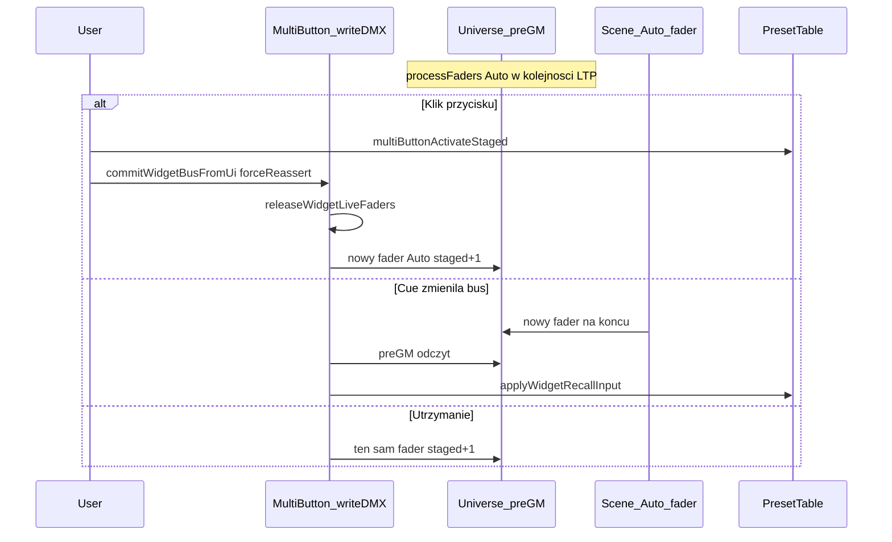

# Multi Button — Shared bus (Preset Table Widget mode)

Dokument opisuje tryb **Shared bus** w Multi Button podłączonym do **Preset Table v2** (tryb Widget). Wyjaśnia, dlaczego wcześniejsze podejścia nie działały, jak działa naprawa oraz jak poprawnie podłączyć kanał DMX z cuelistą / snapshotami.

## Cel

Jeden kanał DMX ma pełnić **dwie role**:

| Kierunek | Rola |
|----------|------|
| **Publish (wyjście)** | Multi Button utrzymuje na busie aktualny **staged** (wartość `indeks + 1`, `0` = off), żeby można było zapisać cue / snapshot. |
| **Recall (wejście)** | Odtworzenie cue ustawia ten sam kanał → Preset Table **przyjmuje** staged z cue. |

Wymaganie użytkowe: **ostatnia akcja wygrywa** — klik przycisku trzyma wybór nad graną cue; nowo odpalona cue przejmuje bus i staged w tabeli.

---

## Kontekst QLC+ (dlaczego to w ogóle jest trudne)

DMX w QLC+ składa się z dwóch faz w każdym ticku MasterTimera:

1. **Aktualizacja faderów** — `Function::write()` (Scene z cuelisty), potem `DMXSource::writeDMX()` (VC widgety, w tym Multi Button). Żaden z nich nie pisze „na żywo” do wyjścia — tylko ustawia `GenericFader` / `FadeChannel`.
2. **Merge** — wątek universe: `Universe::processFaders()` łączy fadery wg **priorytetu** i reguł HTP/LTP do bufora `preGM`, potem Grand Master → `postGM` → hardware.

Priorytety faderów (`universe.h`):

| Priorytet | Wartość | Typowy użytkownik |
|-----------|---------|-------------------|
| `Auto` | 0 | Scene, Chaser, większość funkcji |
| `Override` | 1 | VC Slider (monitor), stary Multi Button |
| `Flashing` | 2 | Flash |
| `SimpleDesk` | 3 | Simple Desk |

Fadery w liście są przetwarzane **od najniższego priorytetu do najwyższego**. Na kanale **LTP** (last takes precedence) wygrywa **ostatni** fader w kolejce **w ramach tego samego merge**. Nowy `requestFader()` jest **dokładany na koniec** swojego pasma priorytetu.

Kanał selektora powinien być **surowym DMX** (nie kanałem intensity fixture) — wtedy domyślnie jest **LTP**, a mechanizm „ostatnia akcja wygrywa” działa naturalnie.

---

## Co było źle — wersja 1 (Override co klatkę)

Pierwsza integracja recall/snapshot używała w `writeDMX()`:

- `requestFader(Universe::Override)`
- `FadeChannel::Override` (force LTP)

**Skutek:** Scene z cuelisty pisała na **Auto**, Multi Button na **Override**. Override jest **zawsze** po Auto w `processFaders()` → MB **permanentnie** wygrywał na kanale. Cuelista nie mogła zmienić wartości — kanał wyglądał na zablokowany.

Dodatkowo logika „odczytaj bus, jeśli ≠ staged → recall” czytała `preGMValue()` **po** merge z poprzedniego ticku, gdzie często **już była wartość MB**. Warunek `bus == target` (staged) był spełniony przez własny zapis → **recall z cue nigdy nie wchodził**.

---

## Co było źle — wersja 2 (tylko sendFeedback)

Żeby odblokować cue, usunięto ciągły Override i zostawiono głównie `sendFeedback()` przy zmianie.

**Skutki:**

- Brak **stabilnej** wartości na busie → snapshoty / cue nie widziały staged do zapisu.
- Wyścigi: klik ustawiał staged, ale w następnej klatce stary bus z cue → natychmiastowy recall i cofnięcie wyboru w UI.

---

## Jak działa Shared bus (obecna implementacja)

Pliki: [`multibuttonwidget.cpp`](../multibuttonwidget.cpp) (`writeDMX`, `writeWidgetBusChannel`, `commitWidgetBusFromUi`, `applyWidgetRecallInput`).

### 1. Pisanie jak Level, na priorytecie Auto

```cpp
writeWidgetBusChannel(universes, universe, channel, targetValue,
                      Universe::Auto, false);
```

- Ten sam poziom co Scene z cuelisty.
- **Bez** `FadeChannel::Override` — merge LTP decyduje, kto wygrał **ostatni** fader na liście Auto.
- Co tick MB **utrzymuje** na busie `selectorIndexToBusValue(staged)` (indeks + 1, lub 0).

### 2. Ostatnia akcja wygrywa (LTP)

| Zdarzenie | Co się dzieje |
|----------|----------------|
| **Odpalenie cue** | Nowy fader Scene → koniec listy Auto → cue zmienia `preGM` na busie. |
| **Klik przycisku MB** | `releaseWidgetLiveFaders()` + nowy fader MB → znowu **koniec** listy Auto → MB przejmuje kanał (manual sticky nad graną cue). |

### 3. Edge detection — adopt z cue

W `writeDMX()` (Shared bus):

```text
busValue = universes[u]->preGMValue(channel)
targetValue = staged z Preset Table (przez widgetBusTargetIndex)

jeśli busValue != m_widgetBusLastSeen
   && !grace po kliknięciu
   && !forceReassert po kliknięciu
→ applyWidgetRecallInput(busValue)  // multiButtonActivateStaged na PT
→ return (nie nadpisuj w tej klatce — cue zostaje na busie)
```

`m_widgetBusLastSeen` to ostatnia wartość DMX, którą MB uznał za stan busa — **nie** porównanie „bus vs staged”, które myliło własny zapis z cue.

### 4. Grace i reassert po kliknięciu UI

`commitWidgetBusFromUi()` (wywoływane z `activate` / `publishSelectorToBus`):

- `m_widgetBusForceReassert = true` — następny tick **zniszczy** stary fader MB i utworzy nowy (wygrana LTP).
- `m_publishSuppressTimer` (~250 ms) — przez chwilę **nie** adoptujemy ze starego busa (cue nie cofa świeżego kliku).
- `applyWidgetRecallInput` w grace **return** — ignoruje echo z inputu.

### 5. Dwa wejścia do staged (bez konfliktu z inputami PT)

| Źródło | Ścieżka |
|--------|---------|
| Klik MB | `multiButtonActivateStaged()` bezpośrednio na Preset Table |
| Cue na kanale MB | `applyWidgetRecallInput()` po wykryciu `bus != lastSeen` |

Kanał **Selector / recall** w Properties Multi Button (`m_widgetLiveInputSource`) jest **osobny** od inputów „live selector / snapshot” w edytorze outputu Preset Table. Nie podpinaj tego samego adresu do obu bez potrzeby.

---

## Przepływ jednego ticka



---

## Ramki przycisków (layout Spread)

W trybie **Widget** połączonym z Preset Table (Primary / Secondary / Continuous / MultiFX):

| Kolor | Znaczenie |
|-------|-----------|
| **Zielona** | **Staged** — wybór zapisany w PT, czeka na commit crossfade |
| **Pomarańczowa** | **Live** — aktualnie odtwarzany wiersz / preset w PT |

Po commicie crossfade (`promoteStagedToLive`) staged znika w PT → Multi Button pokazuje **tylko pomarańczową** ramkę na przycisku live (odczyt bezpośrednio z `multiButtonLiveIndex` / `multiButtonHasStagedIndex`, sync w `writeDMX`).

Transition preset idzie od razu na live (bez zielonej ramki staged).

---

## Wpływ na parametry Preset Table

Shared bus dotyczy **tylko kanału DMX** skonfigurowanego w Multi Button. Logika staged/live po stronie Preset Table **bez zmian**.

| Parameter (Multi Button) | Aktywacja z MB | Crossfade / staged w PT |
|------------------------|----------------|-------------------------|
| Primary row | `multiButtonActivateStaged` | staged + crossfade |
| Secondary row | staged | staged + crossfade |
| Continuous FX preset | staged | wg trybu Continuous FX selector w PT |
| MultiFX preset | staged | staged |
| Transition preset | **`multiButtonActivate` (live)** | od razu live, nie staged przez MB |

**Jeden widget Multi Button = jeden Parameter + jeden Output + jeden kanał snapshot.**

---

## Zalecane podłączenie

### Zasady

1. Multi Button: **Mode = Widget**, **Bus policy = Shared bus (cue + snapshot)**.
2. Ten sam **Preset Table**, ten sam **Output index** co sterujesz.
3. **Selector / recall channel** — surowy kanał DMX (U/C), ten sam w cue/snapshotach.
4. **Nie** mapuj tego samego kanału jednocześnie jako VC input Preset Table i MB (unikaj podwójnego sterowania).

### Przykład wielu parametrów

| Multi Button | Parameter | Kanał (przykład) |
|--------------|-----------|------------------|
| MB Rows | Primary row | U1 Ch 10 |
| MB Cont FX | Continuous FX preset | U1 Ch 11 |
| MB MultiFX | MultiFX preset | U1 Ch 12 |
| MB Trans (opcja) | Transition preset | U1 Ch 13 |

### Primary row + crossfade

1. Preset Table: **Enable crossfade**.
2. MB: Primary row, Shared bus, osobny kanał snapshot.
3. Klik → staged; commit crossfade w PT (suwak / input global crossfade).
4. Cue na kanale → recall staged; klik → reassert i trzymanie nad graną cue.

### Continuous FX / MultiFX

1. Bank presetów w **EFX Engine** (Continuous / MultiFX).
2. MB: odpowiedni Parameter, osobny kanał.
3. W PT Properties: **Continuous FX selector mode** = Staged commit lub Smooth morph (jeśli staged ma iść przez crossfade, nie „Live”).

### Transition preset

- Klik MB zmienia preset **na żywo** (nie staged crossfade).
- Snapshot na kanale nadal zapisuje **który** transition jest wybrany.
- Do crossfade primary row używaj osobno Primary row + ewentualnie input Transition w PT.

---

## Hold override (legacy)

W Properties Multi Button: **Hold override (legacy)** — stary tryb z `Universe::Override` co klatkę. Cuelista zwykle **nie** przejmie kanału. Używaj tylko do debugu lub starego zachowania.

---

## Powiązane commity

- `8e100a330` — Link multibutton preset table selector recall (baseline iface + kanał recall).
- `db23dd30b` — Fix Multi Button Shared bus for cue snapshots (Auto + LTP + last-action-wins).

## Zobacz też

- [Preset Table v2 ↔ EFX API](../../presettablev2/docs/presettablev2-efx-api.md)
- [VC Widget Plugin Dev Guide](../../VC_WIDGET_PLUGIN_DEV_GUIDE.md)
