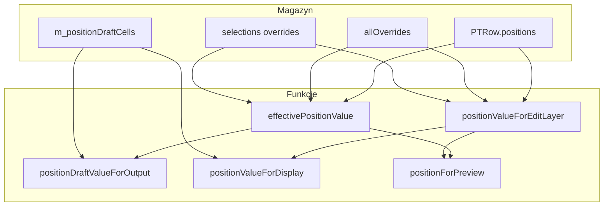
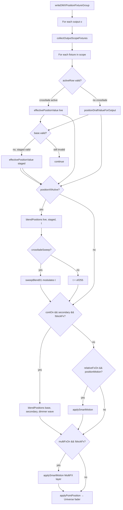
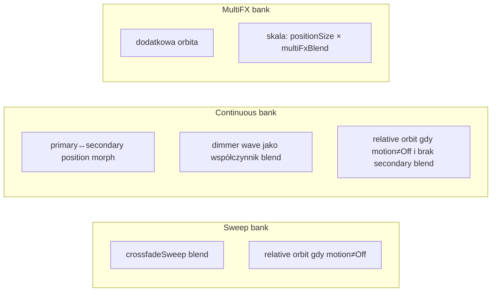

# Preset Table v2 — Position Mode & Position FX — Architektura

Dokument opisuje tryb **Position** w VC widgetcie Preset Table v2 oraz powiązane **Position FX**. Przeznaczony do dalszej analizy, review i planowania zmian.

**Kod źródłowy:** `plugins/vcwidgets/presettablev2/` (+ `presettablev2transition/` dla banków presetów)

**Powiązany dokument (Fixture Group / matrix):** [`presettablev2-efx-api.md`](presettablev2-efx-api.md)

---

## 1. Streszczenie

Position Mode (`PTMode::Position = 2`) to tryb pracy oparty na **fixture group** — zamiast kolumn DMX (dimmer, color itd.) przechowuje **pozycje Pan/Tilt w stopniach** per komórka siatki FG.

| Aspekt | Fixture Group mode | Position mode |
|--------|-------------------|---------------|
| Dane wiersza | `PTRow.values[]` (kanały) | `PTRow.positions[QLCPoint]` |
| Wyjście DMX | Kanały z `PTColumn` bindings | Kanały Pan/Tilt z definicji fixture |
| Matrix / spatial chase | `writeMatrixSpatial` — sweep przy zmianie wiersza | **Nie używane** — tylko crossfade + FX warstwy |
| Flash | Tak | **Wyłączony** (`beginWidgetStagedFlashLocked` early return) |
| FX orbit | N/A (dimmer wave) | `PTPositionFxEngine::applySmartMotion` |

Position mode **współdzieli** z FG mode: outputs, staged/live rows, crossfade, selektory Transition/Continuous/MultiFX, link do EFX Engine (Transition widget).

---

## 2. Model danych

### 2.1 Wartość pozycji

```cpp
struct PTPositionValue {
    bool  valid = false;
    qreal panDeg = 0;
    qreal tiltDeg = 0;
};
```

- Jednostka: **stopnie** względem zakresu fixture (z `PTPositionConverter::degreesRange`).
- Konwersja DMX: `PTPositionConverter` — 16-bit coarse/fine, clamp.
- **Custom Pan/Tilt Range:** gdy `Fixture::hasPanTiltRange(head)`, konwerter zapisuje **logiczny** 16-bit (0 = `rangeMin`, 65535 = `rangeMax` w stopniach custom). `Universe::applyPanTiltScaling` mapuje to na fizyczny DMX — tak jak VC XY Pad. Reverse jest tylko w Universe, nie w konwerterze.
- Bez custom range: deg / `physicalMax` → 16-bit (jak wcześniej).

### 2.2 Wiersz presetu

```cpp
struct PTRow {
    QString name;
    QVector<uchar> values;                    // nieużywane w Position DMX
    QMap<QLCPoint, PTPositionValue> positions; // kanoniczne pozycje wiersza
};
```

### 2.3 Warstwy override (per wiersz × per output)

```
PTRow.positions[point]           ← baza wiersza (output = -1 w edytorze)
    ↓
m_positionOverrides[row][output].allOverrides[point]
    ↓
m_positionOverrides[row][output].selections[sel].overrides[point]
    (tylko gdy point ∈ selections[sel].cells)
```

Struktury:

| Struktura | Pola | Rola |
|-----------|------|------|
| `PTPositionSelectionLayer` | `name`, `color`, `cells`, `overrides` | Podzbiór komórek z własnymi pozycjami |
| `PTPositionOutputLayer` | `allOverrides`, `selections[]` | Override całego outputu lub selection layers |
| `PTPositionDraftContext` | `row`, `output`, `selection` | Zakres niezapisanego draftu |

Storage: `m_positionOverrides[rowIdx][outputIdx]`.

### 2.4 Draft (edytor, niezapisany)

| Pole | Typ | Opis |
|------|-----|------|
| `m_positionDraftDirty` | bool | Są niezapisane zmiany |
| `m_positionDraftCtx` | `PTPositionDraftContext` | Na którym wierszu/warstwie edytujemy |
| `m_positionDraftCells` | `QMap<QLCPoint, PTPositionValue>` | Wartości per komórka |

Draft **nie jest** w XML do momentu Overwrite / Save As. W Operate, gdy edytujemy **live row**, draft może iść na DMX (preview) — patrz sekcja 3.

### 2.5 Playback: live vs staged (per output)

Wspólne z Fixture Group mode — mutex `m_stateMutex`:

| Wektor | Znaczenie |
|--------|-----------|
| `m_activeRow[o]` | Live primary row (-1 = off) |
| `m_stagedRow[o]` + `m_stagedRowValid[o]` | Staged primary (cel crossfade) |
| `m_liveSecondaryRow[o]` / `m_stagedSecondaryRow[o]` | Secondary row dla Continuous FX |
| `m_liveSweepPreset[o]` / `m_stagedSweepPreset[o]` | Indeks presetu Sweep |
| `m_liveContinuousPreset[o]` / `m_stagedContinuousPreset[o]` | Indeks presetu Continuous |
| `m_liveMultiFxPreset[o]` / `m_stagedMultiFxPreset[o]` | Indeks presetu MultiFX |
| `PTOutput` defaults | `sweepPresetIndex`, `continuousPresetIndex`, `multiFxPresetIndex`, `secondaryRowIndex` |

### 2.6 Output scope

```cpp
enum class PTOutputScope { Rows, Mask, RowsAndMask };
```

`collectOutputScopeFixtures` filtruje komórki FG wg scope outputu i maski dokumentu.

---

## 3. Pipeline rozwiązywania wartości

### 3.1 Funkcje (od najniższej do najwyższej abstrakcji)



#### `effectivePositionValue(row, output, point)` — **źródło prawdy DMX (committed)**

1. Baza: `m_rows[row].positions[point]`
2. Jeśli `output >= 0`: dla każdej selection layer — jeśli `point ∈ cells` i jest override → **return override**
3. Jeśli `allOverrides` ma point → return
4. Return baza

**Plik:** `presettablev2widget.cpp` ~1717–1736

#### `positionValueForEditLayer(row, output, selection, point)` — **surowa warstwa bez dziedziczenia**

- `output < 0` → row.positions
- `selection >= 0` → `selections[selection].overrides`
- else → `allOverrides`

Używane w edytorze i draft.

#### `positionValueForDisplay` — UI edytora

Draft nadpisuje edit layer gdy kontekst się zgadza.

#### `positionDraftValueForOutput(output, row, point)` — DMX z draft preview

Gdy `positionDraftAppliesToDmx(output, activeRow)` i komórka w draft:
- Merge draft z innymi warstwami wg kontekstu (`output`, `selection`)
- W przeciwnym razie → `effectivePositionValue`

**Warunek draft na DMX:**

```cpp
activeRow == draftCtx.row
&& (draftCtx.output < 0 || draftCtx.output == outputIdx)
```

#### `positionForPreview` — Transition widget (orbit preview)

- `selectionIdx > 0` → edit layer selection
- else → `effectivePositionValue`

### 3.2 Diagram warstw (logiczny stack)

```
┌─────────────────────────────────────────────────────────────┐
│  Warstwa 6: MultiFX orbit          (applySmartMotion)       │
├─────────────────────────────────────────────────────────────┤
│  Warstwa 5: Relative orbit FX      (Sweep/Cont preset motion)│
├─────────────────────────────────────────────────────────────┤
│  Warstwa 4: Continuous morph       (blend primary↔secondary) │
├─────────────────────────────────────────────────────────────┤
│  Warstwa 3: Crossfade              (live row ↔ staged row)  │
│             opcjonalnie sweepBlend01 (morph po siatce)        │
├─────────────────────────────────────────────────────────────┤
│  Warstwa 2: Draft preview          (tylko gdy NIE crossfade)│
├─────────────────────────────────────────────────────────────┤
│  Warstwa 1: Committed position     (effectivePositionValue) │
│             row → selection override → allOverrides           │
└─────────────────────────────────────────────────────────────┘
                              ↓
                    applyPointPosition → DMX Pan/Tilt
```

**Reguły crossfade (po ostatniej poprawce):**

- Podczas aktywnego crossfade (`stagedRowValid && m_crossfadeEnabled && hasStaged`):
  - **Oba** końce blendu używają `effectivePositionValue` (bez draftu)
  - `blockFxDuringXf = true` → wyłączone: relative orbit, continuous morph, MultiFX
- Po `promoteStagedToLiveLocked()`: `clearPositionDraft()` + odświeżenie UI

---

## 4. Pipeline DMX — `writeDMXPositionFixtureGroup`

**Wejście:** `writeDMX` → `writeDMXFixtureGroup` → early return dla Position.

**Plik:** `presettablev2widget.cpp` ~6055–6264

### 4.1 Diagram przepływu (per output × per fixture)



### 4.2 Zegary i fazy

| Zegar | Wektor | Użycie |
|-------|--------|--------|
| Continuous / relative FX | `m_continuousElapsedMs[o]` | Faza orbit + dimmer wave dla Continuous morph |
| MultiFX | `m_multiFxElapsedMs[o]` | Osobny cykl MultiFX |
| Crossfade clock | `m_crossfadeClockElapsedMs` | Auto-promote gdy manual control off |

`cycleDurationMsLocked(globalFx, preset)` — długość cyklu z **global Speed** (min/max ms) × **preset `speedMultiplier`**. Pole `durationMs` w presecie jest ukryte w UI Position; używane tylko gdy MIDI trzyma `InputDuration` live.

Faza per fixture:

```
iterator = PTDimmerWaveEngine::iteratorFromElapsed(
    elapsedMs, cycleMs, startOffset, headOffset, serialTimeOffset)
angle = iterator * 2π
```

`headOffset` i `serialTimeOffset` z `PTSpatialFixturePlan` (wings, blocks, offset direction, propagation).

### 4.3 `applyPointPosition`

- `resolvePositionChannelsForFixture` — Pan/Tilt (PositionPan/Tilt preset lub grupa Pan/Tilt)
- `panDeg`/`tiltDeg` → 16-bit → `applyFadeValueTimed` na kanałach
- W Position path `fadeTimeMs = 0` (brak fade per-kanał w tej ścieżce)

### 4.4 Czego Position mode NIE robi

- `writeMatrixSpatial` — brak auto-sweep przy zmianie primary row
- `beginWidgetStagedFlashLocked` — natychmiastowy return
- Spatial chase (`m_spatialChase`) — nie dotyczy Position DMX

---

## 5. Position FX — typy i silnik

Position FX to **relatywna orbita wokół pozycji bazowej** (nie dimmer wave). Osobny enum od `waveShape`:

### 5.1 `PTPositionMotion`

| Wartość | Nazwa UI | Kształt (`PTPositionFxEngine::Shape`) | Pan | Tilt |
|---------|----------|--------------------------------------|-----|------|
| 0 | Off | — | — | — |
| 1 | Pan 1D | PanOnly | `waveShape` / `customCurve` (morph packet) | — |
| 2 | Tilt 1D | TiltOnly | — | `waveShape` / `customCurve` |
| 3 | Circle 2D | Circle | sin(φ) | cos(φ) |
| 4 | Line 2D | Line | sin(φ) | sin(φ) |
| 5 | Figure-8 2D | Figure8 | sin(φ) | sin(2φ) |

**Plik:** `presettablev2effectengine.h` ~78–86, `ptpositionfxengine.cpp`

### 5.2 Smart Motion (kompresor zakresu)

`applySmartMotion(base, fixture, head, shape, phase, size01)`:

1. `size01 = globalFx.positionSize / 255` (× `m_multiFxBlend/255` dla warstwy MultiFX)
2. Amplituda = `size01 * halfRange` per oś
3. **Pivot shift:** jeśli orbita przy bazowej pozycji wychodziłaby poza zakres fixture, pivot przesuwa się do dozwolonego pasma (`pivotAndAmplitude`)
4. Wynik = pivot + amplitude × shape(φ), clamp

**Uwaga:** Pola presetu `positionPanSize` / `positionTiltSize` są zapisywane i widoczne w preview Transition widget, ale **runtime DMX używa wyłącznie globalnego `positionSize`** (preview hardcode `1.0`).

### 5.3 Trzy „banki” FX w Position DMX



#### Sweep (`PTTransitionMode::SweepOnly`)

- **Crossfade sweep:** gdy `crossfadeSweepModeLocked` → `sweepBlend01` moduluje postęp crossfade per fixture (wave front po siatce)
- **Relative orbit:** gdy `sweepEfxActive`, spatial on, `positionMotion ≠ Off`, continuous nie przejmuje warstwy

#### Continuous (`PTTransitionMode::Continuous`)

- Wymaga **secondary row** (`m_liveSecondaryRow` lub staged)
- `blendPositions(primary, secondary, dimmer)` gdzie `dimmer = matrixDimmerAtPoint(...)` — **ta sama** fala co dimmer w FG mode, ale blenduje **pozycje**
- Continuous **blokuje** crossfade sweep gdy jest aktywny secondary

#### MultiFX (`PTTransitionMode::MultiFx`)

- Osobny preset, osobny zegar `m_multiFxElapsedMs`
- Nakładka orbit na już obliczoną pozycję
- Siła: `(positionSize/255) × (m_multiFxBlend/255)`
- Sync fazy z crossfade: `m_syncMultiFxPhaseToCrossfade`, `syncMultiFxPhaseOnCrossfadeMotionLocked`

### 5.4 Aktywacja FX (flagi per output)

```cpp
contOn     = continuousEfxActiveForOutputLocked(o)   // live preset ≥0 lub staged valid
sweepOn    = sweepEfxActiveForOutputLocked(o)          // live sweep preset ≥0
multiFxOn  = multiFxActiveForOutputLocked(o)
spatialOn  = m_spatialEffects.enabled
blockFxDuringXf = m_crossfadeEnabled && hasStaged
relativeFxOn = spatialOn && !blockFxDuringXf && (contOn || sweepOn || multiFxOn)
```

`resolveOutputPlaybackStateLocked` zbiera te flagi + `crossfadeTransition`, `secondaryRow`.

---

## 6. Crossfade & staging

### 6.1 Manual vs clock

| Tryb | Źródło postępu | Promote |
|------|----------------|---------|
| Manual (domyślny) | Fader VC `m_crossfadeGlobalPos` (input 240) | Gdy fader dojdzie do krawędzi (`slotInputValueChanged`) |
| Clock | `tickCrossfadeClockLocked` → `m_crossfadeClockProgress01` | Auto przy progress ≥ 1.0 |

Manual control: `TransitionProvider::crossfadeManualControlEnabled()` (checkbox w EFX Engine).

Postęp: `cueListCrossfadeProgress01(globalPos, startPos, stagedAtLowSide)` — semantyka jak Cue List QLC+.

### 6.2 Staging session

`armCrossfadeStagingLocked()`:
- Gdy crossfade on, manual on, brak pending staged changes
- Ustawia `m_crossfadeSessionActive`, `m_crossfadeEditLaneStaged = true`
- Nowe selekcje wierszy/presetów idą do **staged** lane

`crossfadeRoutesToStagedLocked()` = `m_crossfadeEnabled && m_crossfadeEditLaneStaged`

### 6.3 Crossfade sweep (Position)

`crossfadeSweepModeLocked(output, activeRow, hasStaged)` (Position mode):

```
crossfade ON && hasStaged && sweep preset aktywny
```

W Position **nie** blokuje sweep crossfade przy ustawionym secondary row (row morph to osobna ścieżka).

Blend crossfade używa `sweepBlend01` z presetu **Transitions/Sweep**; row morph primary↔secondary używa presetu **Continuous** (`matrixDimmerAtPoint`).

### 6.3b Dwa blendy pozycji

| Blend | Sterowanie | Preset bank |
|-------|------------|-------------|
| Crossfade presetów (live↔staged) | Fader / MB | **Sweep** (Row morph kolumny w Sweep = front crossfade) |
| Row morph (primary↔secondary) | Secondary row + Continuous ON | **Continuous** (kolumny Row morph / fade) |

`offsetStep = 0` — wszystkie lampy w tej samej fazie przestrzennej. Orbit/MultiFX w Position: propagation wymuszony Parallel (offset zamiast Serial chase).

### 6.4 Promote

`promoteStagedToLiveLocked()` (~4711):
- Staged row → `m_activeRow`
- Staged secondary / continuous / multiFX → live vectors + `PTOutput` defaults
- Czyści staged flags, `syncCommittedPlaybackStateLocked`
- **Position:** jeśli `m_positionDraftDirty` → `clearPositionDraft()`, `m_positionPromoteUiRefresh = true`
- UI refresh po zwolnieniu mutexa (`writeDMX` tail lub `flushPositionPromoteUiIfNeeded`)

---

## 7. Edytor Position (UI)

### 7.1 Komponenty

| Widget | Plik | Rola |
|--------|------|------|
| `m_positionPresetTree` | widget | Drzewo: Preset → General / Output [/ All + Selection]; `(LIVE)` w Operate |
| `m_positionGrid` | `ptpositionfixturegridwidget.*` | Siatka FG, multi-select |
| `m_positionXYPad` | `ptpositionxypadwidget.*` | Normalized pan/tilt |
| Spiny Pan/Tilt | widget | Wartości w stopniach |
| Copy layer / Paste layer | widget | Kopiowanie komórek między General / Output / Selection |
| Spread | widget | Symmetric spread (≥2 komórki) |
| Overwrite / Save As / Revert | widget | Commit / discard draft |

Design mode: ukrywa tabelę kolumn (`m_tableWrap`). Operate: sync edit row z `m_activeRow[m_positionEditOutput]`.

### 7.2 Selekcja siatki

- Click — pojedyncza komórka
- Shift — prostokąt od anchor
- Ctrl — toggle
- Sygnał: `selectionChanged(cells, order)` — **order** używany przez spread

### 7.3 Symmetric spread

Włączony gdy checkbox + ≥2 zaznaczone komórki.

| Parametr UI | Kod | Efekt |
|-------------|-----|-------|
| Spread slider 0–255 | `positionSpreadSigned(raw)` | 128 = 0%; asymetryczne mapowanie ±100% |
| Axis combo | Pan / Tilt | Pan: `centerPan + spread × panNorm × panAmp`; Tilt: `centerTilt - spread × tiltNorm × tiltAmp` |
| Pivot | Spiny Pan/Tilt | Środek rozkładu (nie uśrednianie z komórek podczas spread) |
| `panNorm` | `(i - centerIdx) / maxOff` | Kolejność selekcji |
| `tiltNorm` | `abs(panNorm)` | Oba końce na zewnątrz |
| `panAmp`/`tiltAmp` | `symmetricHeadroom(pivot, min, max)` | Dostępny zakres od pivotu do krawędzi |

Double-click na slider → reset do 128. Zmiana osi Pan/Tilt → reset slidera.

### 7.4 Draft workflow

| Akcja | Funkcja |
|-------|---------|
| Zmiana XY / spin / spread | `stageFromEditorControls` |
| Overwrite | `commitPositionDraftOverwrite` → `applyDraftToRowData` |
| Save As | Nowy `PTRow` + overrides |
| Revert | `clearPositionDraft` |
| Zmiana row/layer | `confirmDiscardPositionDraft` |

`writePositionToCells` — zapis do row lub `m_positionOverrides` (mutex).

---

## 8. Integracja z Transition widget (EFX Engine)

### 8.1 Link

- Table: `m_linkedTransitionWidgetId`
- Provider API: `presettablev2transitionprovideriface.h`
- Control API: `presettablev2controliface.h` (`tableUsesPositionMode`, `positionForPreview`, …)

### 8.2 Widoczność kolumn w Position mode

`applyPositionModeColumnVisibility` (`presettablev2transitionwidget.cpp` ~364):

| Bank | Widoczne kolumny |
|------|------------------|
| **Sweep** | Axis, Offset, Wings, Blocks, Morph shape, Fade in, Wave width, Duration, Propagation, Speed mult, … (bez Fade out / Wave level / Motion) |
| **Continuous / MultiFX** | Jak Fixture Group Continuous **+** Duration **+** Position motion (wave width/shape, fade in/out, wave level, wings, offset, propagation, …) |
| Ukryte globalnie (Position) | Tylko **Position pan/tilt size** per preset (amplituda z global `positionSize`) |
| Rename | `waveShape` → **„Morph shape”** w Sweep |

**Brak kolumny Motion** w banku Transitions (Sweep) — motion tylko w Continuous/MultiFX.

### 8.3 Co działa / nie działa w Position

| Feature | Position |
|---------|----------|
| Banki Sweep / Continuous / MultiFX | Tak |
| Global speed, min/max ms, positionSize | Tak |
| Per-preset offset, wings, blocks, propagation | Tak (faza / sweep blend) |
| Per-preset positionMotion | Tak (orbit) |
| Per-preset positionPanSize/TiltSize | **Tylko preview/XML** |
| Matrix sweep on row change | **Nie** |
| Widget flash | **Nie** |
| Spatial grid preview | Tak (Transition widget) |
| Per-output / per-point preset overrides | Tak (`transitionPresetAtIndexLocked` + `&point`) |

### 8.4 Continuous FX selector mode (table property)

| Tryb | Zachowanie |
|------|------------|
| `Live` | Zmiana presetu Continuous od razu na live |
| `StagedCommit` | Preset idzie do staged; commit przy promote |
| `SmoothMorph` | Jak staged + morph przez crossfade (FG matrix; Position używa staged secondary) |

---

## 9. Katalog parametrów

### 9.1 Preset Table — właściwości widgetu

| Parametr | Pole / ID | Efekt w Position |
|----------|-----------|------------------|
| Mode | `m_mode = Position` | Cała ścieżka DMX + UI |
| Fixture group | `m_fixtureGroupId` | Siatka, zakres komórek |
| Outputs | `m_outputs[]` | Scope, domyślne indeksy FX, secondary row |
| Crossfade enabled | `m_crossfadeEnabled` | Staging + blend |
| Continuous FX selector mode | `m_continuousFxSelectorMode` | Live vs staged |
| Linked Transition | `m_linkedTransitionWidgetId` | Presety + global FX |
| Spatial effects | `m_spatialEffects.enabled` | Gate dla `relativeFxOn` |
| MultiFX blend | input **241** `m_multiFxBlend` | Siła warstwy MultiFX |
| MultiFX restart | input **242** | Reset `m_multiFxElapsedMs` |
| Widget flash behavior | `m_widgetFlashBehavior` | Bez efektu (flash disabled) |

### 9.2 VC Input IDs (`presettablev2inputids.h`)

| ID | Stała | Funkcja |
|----|-------|---------|
| 0–47 | `rowSelector(o)` | Primary row (live/staged via crossfade) |
| 48–95 | `transSweep(o)` | Sweep preset index (0 = instant/off) |
| 96–143 | `transSecondaryRow(o)` | Secondary row dla Continuous |
| 144–191 | `transContinuousBank(o)` | Continuous preset index |
| 192–239 | `multiFxBank(o)` | MultiFX preset index |
| 240 | `kCrossfade` | Postęp crossfade + promote |
| 241 | `kMultiFxBlend` | 0–255 siła MultiFX |
| 242 | `kMultiFxRestart` | Restart fazy MultiFX |
| 243 | `kWidgetFlashGate` | Flash (ignorowany w Position) |

### 9.3 Global FX (`PTGlobalEffectSettings`)

| Pole | Domyślnie | Position |
|------|-----------|----------|
| `speed` | 128 | Czas cyklu (z min/max) |
| `minDurationMs` / `maxDurationMs` | 100 / 5000 | Skala czasu |
| `speedMultiplier` | 1 | 0.5×…5× |
| `intensity` | 255 | **Tylko FG channels** — nie Position |
| **`positionSize`** | 255 | **Amplituda orbit** (0=off, 255=full smart range) |
| `fxBlocks` | 1 | Grupy fazowe |
| `fxPhaseOffset` | 0 | Przesunięcie fazy 0–255 |
| `fxWingsSymmetry` | 0 | Normal / Alternate / Mirror |
| `fxOrientation` | 0 | Oś X vs Y dla offsetów |
| `fxMultiplier` | 1 | Mnożnik offsetów |

### 9.4 Per-preset (`PTTransitionPreset`)

| Pole | Sweep crossfade | Continuous morph | Relative orbit | Preview |
|------|-----------------|------------------|----------------|---------|
| `enabled` | tak | tak | tak | — |
| `axis` | tak (offset) | — | tak (via global orient) | tak |
| `offsetDirection` | tak | — | tak | tak |
| `offsetStep` | tak | — | tak | tak |
| `wings`, `blocks`, `wingsSymmetry` | tak | — | tak | tak |
| `durationMs` | — (global Speed) | — (global Speed) | — (global Speed) | tylko MIDI live |
| `waveWidth` | sweep window | dimmer wave | orbit active window | tak |
| `waveShape` / Morph shape | blend curve | dimmer wave | — | tak |
| `waveFadeIn` / `waveFadeOut` | tak | tak | 1D orbit envelope; **0% fade out = instant step down** at packet end; idle holds curve end (min for tilt up); DMX uses same iterator as dimmer (head offset in iterator) | tak |
| `waveLevel` | — (ukryte UI) | tak | — | — |
| `startOffset` | tak | tak | tak | tak |
| `customCurve` | tak | tak | — | tak |
| `propagation` | Serial/Parallel | tak | tak | tak |
| `playbackMode` | bank bucket | bank bucket | bank bucket | — |
| `transitionDirection` | wave front | — | — | tak |
| `speedMultiplier` | tak | tak | tak | tak |
| `stepDelayMs`, `fadeMs` | legacy spatial | legacy | — | — |
| **`positionMotion`** | — (ukryte w Sweep UI) | tak | tak | tak |
| **`waveShape` / `customCurve`** | Row morph | 1D orbit curve (ten sam pakiet co morph) | tak | tak |
| **`position1DBuiltinMode`** | — | Morph packet vs Oscillate (builtin 1D) | tak | tak |
| **`positionPath2D`** | — | Custom 2D path | tak | tak |
| **`positionMotionDirection`** | — | — | FWD/REV/ALT-W/SYM-P | tak |
| `positionPanSize`, `positionTiltSize` | — | **preview only** | **preview only** | tak |

---

## 10. Stan, mutex, flagi

### 10.1 `m_stateMutex`

- Całe `writeDMX` (w tym tick crossfade clock)
- Mutacje danych: rows, overrides, draft, input handlers, promote
- Krótkie locki w refresh UI

**Zasada:** nie wołać `refreshPositionGridCells` wewnątrz `promoteStagedToLiveLocked` — użyć `m_positionPromoteUiRefresh`.

### 10.2 Kluczowe flagi crossfade

| Flaga | Rola |
|-------|------|
| `m_crossfadeGlobalPos` | Pozycja fadera 0–255 |
| `m_crossfadeStartPos` | Punkt startu sesji |
| `m_crossfadeStagedAtLowSide` | Kierunek commit (low→high vs odwrotnie) |
| `m_crossfadeEditLaneStaged` | Nowe selekcje → staged |
| `m_crossfadeSessionActive` | Sesja stagingu uzbrojona |
| `m_crossfadeClockElapsedMs` / `Progress01` | Auto clock |

### 10.3 Flagi edytora Position

| Flaga | Rola |
|-------|------|
| `m_positionDraftDirty` | Draft aktywny |
| `m_positionEditorSyncing` | Blokada pętli XY↔spin |
| `m_positionPromoteUiRefresh` | Odroczony refresh po promote |
| `m_positionEditRow/Output/Selection` | Kontekst edycji |

---

## 11. Mapa plików

| Plik | Odpowiedzialność |
|------|------------------|
| `presettablev2widget.h/.cpp` | Stan, UI, value resolution, DMX, crossfade, draft |
| `presettablev2effectengine.h/.cpp` | Typy: `PTPositionValue`, `PTTransitionPreset`, enums |
| `ptpositionconverter.h/.cpp` | Degrees ↔ DMX, blend, spread headroom |
| `ptpositionfxengine.h/.cpp` | Orbit shapes, smart motion |
| `ptpositionfixturegridwidget.*` | Siatka edytora |
| `ptpositionxypadwidget.*` | XY pad |
| `ptpositionpathpreviewwidget.*` | Podgląd orbity 2D (Circle, Line, Figure-8, Custom 2D) |
| `ptpositionmotion1dpreviewwidget.*` | Podgląd 1D: offset vs czas (Pan/Tilt 1D, Custom Pan/Tilt 1D) |
| `ptspatialfixtureplan.*` | `sweepBlend01`, kolejność spatial |
| `ptdimmerwaveengine.*` | Fala dimmera → faza + continuous blend factor |
| `ptparammatrixengine.*` | `PTGlobalEffectSettings`, duration |
| `presettablev2inputids.h` | Layout inputów VC |
| `presettablev2transitionprovideriface.h` | Kontrakt provider |
| `presettablev2controliface.h` | Kontrakt table dla Engine |
| `presettablev2transition/*` | Banki presetów, global FX UI |
| `presettablev2configdialog.*` | Właściwości widgetu |

---

## 12. Ograniczenia i znane rozbieżności

1. **Brak matrix sweep** przy zmianie primary row — tylko crossfade ręczny/clock + sweep blend w crossfade.
2. **Flash wyłączony** — `requestTableFlash` / staged flash nie wpływają na Position DMX.
3. **`positionPanSize` / `positionTiltSize`** — zapisane w XML i w preview, ale DMX używa tylko `globalFx.positionSize` (jednolita skala obu osi).
4. **Draft vs crossfade** — podczas crossfade DMX ignoruje draft (committed only); po promote draft jest czyszczony.
5. **FX podczas crossfade** — wszystkie warstwy FX zablokowane (`blockFxDuringXf`) dla stabilnego przejścia.
6. **Intensity (global)** — nie skaluje Position DMX (tylko kanały w Fixture Group mode).
7. **Współdzielenie silnika dimmer wave** — Continuous w Position używa `matrixDimmerAtPoint` jako współczynnika blendu pozycji, nie jasności.

---

## 13. Scenariusze testowe (checklist)

- [ ] Crossfade live→staged bez draftu — brak skoku po promote
- [ ] Crossfade z dirty draft na live row — draft cleared po promote
- [ ] Crossfade + sweep morph (`crossfadeSweep`) — front fali po siatce
- [ ] Crossfade + Continuous ON — sweep morph zablokowany; morph primary↔secondary po zakończeniu XF
- [ ] Relative orbit (Circle/Pan/Tilt) z różnym `positionSize`
- [ ] MultiFX layer + `multiFxBlend` fader
- [ ] Symmetric spread Pan vs Tilt, ±100% slider
- [ ] Output layer + selection layer override — `effectivePositionValue` priority
- [ ] Operate: edycja live row — draft preview na DMX bez Overwrite
- [ ] Manual crossfade vs clock crossfade — promote na krawędzi / przy 100%

---

## 14. Referencje kodu (kluczowe funkcje)

| Funkcja | Plik | Linia (approx.) |
|---------|------|-----------------|
| `effectivePositionValue` | presettablev2widget.cpp | 1717 |
| `positionDraftValueForOutput` | presettablev2widget.cpp | 1781 |
| `writeDMXPositionFixtureGroup` | presettablev2widget.cpp | 6055 |
| `applySmartMotion` | ptpositionfxengine.cpp | 93 |
| `crossfadeSweepModeLocked` | presettablev2widget.cpp | 3508 |
| `promoteStagedToLiveLocked` | presettablev2widget.cpp | 4711 |
| `stageFromEditorControls` | presettablev2widget.cpp | 2391 |
| `applyPositionModeColumnVisibility` | presettablev2transitionwidget.cpp | 364 |
| `sweepBlend01` | ptspatialfixtureplan.cpp | — |

---

*Wygenerowano na podstawie kodu GRIDqlc / Preset Table v2 — branch z Position mode workflow. Ostatnia aktualizacja: crossfade jump fix (committed-only blend, block FX during XF, promote clears draft).*
